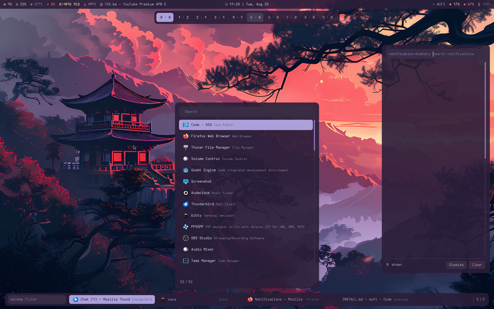

<h1 align="center">
  <br>
  Sofi
</h1>
<p align="center"><b>S</b>akura <b>O</b>fficial <b>F</b>ull <b>I</b>ndexer</p>
<p align="center"><i>The UI display and layer-shell layer of the hikari-sakura Wayland compositor — application menu, task strip, sheet switcher, notification daemon and system tray, from one binary.</i></p>

<p align="center">
  
</p>
<p align="center"><sub>Four surfaces at once — sheet switcher under the top bar, application menu bottom centre, notification history on the right edge, task strip along the bottom. One binary, one invocation each, no configuration file. (Taken before the system tray landed in the task strip's right-hand corner.)</sub></p>

## The name

**Sofi** is the **Sakura Official Full Indexer**.

Sofi began as a hard fork of [rofi](https://github.com/davatorium/rofi). The
acronym came with it, and rather than discard a name users would recognise, it
was kept and given a meaning that describes what the program actually became:

**Indexer** is the literal job. Sofi builds indexes and puts them on screen —
applications from desktop files, executables from `$PATH`, windows from the
compositor, sheets from hikari's control socket, notifications from the session
bus, tray items from StatusNotifierItem, files from the filesystem, hosts from
your SSH config. Every surface you see is an index rendered.

**Full** is the scope. Sofi is not a launcher that a desktop is assembled
around; it *is* the desktop's shell — every system surface hikari-sakura needs,
in one binary.

**Sakura Official** is the family. Sofi is one of three programs built as a set,
described below.

Sofi is developed independently and does not track upstream. It is MIT licensed
— see [COPYING](COPYING) and [AUTHORS](AUTHORS).

> **Sofi is a separate program, not a rofi drop-in.** It does not read rofi's
> configuration, themes, cache or script-mode environment variables, and rofi
> plugins will not load. Configuration lives in `~/.config/sofi/config.sasi`,
> themes use the `.sasi` extension, and script modes receive `SOFI_*` variables.
> File sofi issues here and rofi issues upstream; neither project supports the
> other.

## The Sakura set

Three programs, built to be used together, each usable on its own:

| | Program | Written in | Role |
|---|---|---|---|
| 1 | [**sakura**](https://github.com/orpheus497/sakura) | Zig | **Display manager.** A TUI login manager on a FreeBSD virtual terminal. Talks to OpenPAM directly; no toolkit, no session bus, no login-manager framework |
| 2 | [**hikari-sakura**](https://github.com/orpheus497/hikari-sakura) | C | **Compositor.** A stacking Wayland compositor with tiling, built on views, groups and *sheets* |
| 3 | **sofi** — this repository | C | **Shell.** The compositor's UI display and layer-shell layer |

### How they hand off

Nothing here is private glue — each step is an ordinary published interface, and
that is deliberate:

1. **sakura** enumerates session files from
   `/usr/local/share/wayland-sessions/` — the freedesktop convention, so any
   session works with it, not only this one.
2. **hikari-sakura** installs one: `hikari.desktop`, `Exec=start-hikari`.
   Selecting it at the login screen starts the compositor.
3. **hikari-sakura's shipped configuration already calls sofi.** Its
   `actions {}` block binds four of sofi's surfaces out of the box:

   | Key | Action | Runs |
   |---|---|---|
   | `Logo`+`Space` | `action-menu` | `sofi -show drun` |
   | `Logo`+`w` | `action-windows` | `sofi -show window` |
   | `Logo`+`e` | `action-sheets` | `sofi -show sheets` |
   | `Logo`+`n` | `action-notifications` | `sofi -show notification-history` |

4. **sofi's two daemons** are autostarted in the session — see
   [Autostart](#autostart).

### One palette, and the honest limit of it

Sofi's sixteen colour slots are **byte-identical** to hikari-sakura's
`ui { palette }` block — `color0 #2b1e3a` through `color15 #f0edf2`, all sixteen.
One scheme dresses the compositor, its bar and the shell together, and sofi's
semantic names map onto hikari's `ui { colorscheme }` slot for slot. Change the
sixteen values in one place and the whole desktop follows.

**The display manager cannot join that.** sakura draws on a `vt(4)` console,
which stores a colour in three bits plus a brightness bit — true 24-bit output is
not possible there. It *echoes* the scheme in the sixteen console colours; it
does not share the file. That is a limit of the console, not an omission.

## What sofi does

Sofi presents **five system surfaces** across **seven invocations** of one
binary. Each has its own layout compiled in and its own instance lock, so they
coexist rather than replacing one another — and **none of them needs a
configuration file**.

| Surface | Invocation | Indexes | Where it renders |
|---|---|---|---|
| **Application menu** | `sofi -show drun` | Desktop files | Bottom centre, 560px wide, above the task strip |
| **Task and window manager** | `sofi -show window` | Compositor toplevels | Strip along the bottom, inset from the edges |
| **Sheet switcher** | `sofi -show sheets` | hikari sheets 0–9 | Top centre, a row of ten chips under the compositor's bar |
| **Notifications** — daemon | `sofi -notification-daemon` | `org.freedesktop.Notifications` | Stack in the bottom-right corner |
| **Notifications** — history | `sofi -show notification-history` | The persisted ring | Right edge, 420px wide |
| **System tray** — host | `sofi -tray-daemon` | `org.kde.StatusNotifierWatcher` | No surface of its own — feeds the task strip's right corner |
| *Message toast* | `sofi -e <message>` | *(a utility, not a system surface)* | Top-right corner |

`~/.config/sofi/` is optional, and anything you put there still overrides the
built-in layout. Every placement above is one property in a compiled-in layout,
changeable in four lines — see [Theming](#theming).

Sofi is developed primarily on FreeBSD and targets Wayland via
`zwlr_layer_shell_v1` (bound at version 4). It retains a working X11/xcb backend
and every general-purpose mode it inherited, so it is also usable as a standalone
launcher on other compositors and window managers.

### What sofi is not

- **Not a UI toolkit, and not a library.** It is an application.
- **Not a rofi drop-in.** See the banner above. The shared ancestry is history,
  not compatibility.
- **Not a compositor.** Sofi draws surfaces and indexes state; hikari-sakura owns
  windows, input routing and output management. Where a capability needs the
  compositor — locking the session, logging out — sofi says so rather than
  pretending.
- **Not required by hikari-sakura, and hikari-sakura is not required by sofi.**
  The general-purpose modes run anywhere; the sheet switcher is the one part that
  needs hikari's socket, and it exits cleanly when there isn't one.

## Table of contents

- [The surfaces](#the-surfaces) — what each one does, in detail
- [Theming](#theming)
- [Features](#features)
- [Modes](#modes)
- [Wayland support](#wayland-support)
- [Documentation](#documentation)
- [Installation](#installation)
- [Quickstart](#quickstart)

For exhaustive per-capability reference — every mode, verb, keybinding, daemon,
D-Bus interface and build option — see **[FEATURES.md](FEATURES.md)**.

## The surfaces

### Application menu

```bash
sofi -show drun
```

Rises from the bottom centre, clearing the task strip, with icons and a two-tier
row — application name, then generic name beside it in a lighter weight. This is
the default surface: any mode that is not one of those below gets the same shape,
so `run`, `ssh`, `combi`, `filebrowser` and user script modes all look
consistent.

### Task and window manager

```bash
sofi -show window
```

A strip anchored near the south edge, inset from the screen edges so it reads as
a floating bar. A filter field, the task strip itself, and the system tray in the
right-hand corner. Rows lead with the window title and demote the application
class, because the title is what distinguishes two windows of the same
application.

Beyond switching, it carries task-manager verbs on the Wayland backend:

- `kb-custom-1` — toggle minimise
- `kb-custom-2` — toggle maximise

Minimised windows are surfaced through the `URGENT` display state, so a theme
can style them distinctly. On hikari-sakura, maximise maps onto full-maximize;
there is no separate fullscreen state.

### Sheet switcher

```bash
sofi -show sheets
```

Renders as a horizontal row of ten chips centred under the compositor's top bar.
Each chip is a sheet number and its window count; empty sheets are dimmed and the
current sheet is filled. `kb-custom-1` sends the focused window to the
highlighted chip.

The row is a fixed ten-cell grid rather than a content-sized strip, so the chips
stay in the same place from one invocation to the next.

This mode speaks to hikari's control socket at `$XDG_RUNTIME_DIR/hikari.sock`
rather than to a Wayland protocol — **no standards-track protocol can express
send-to-sheet.** On any other compositor the mode reports that the socket is
absent and exits cleanly; it does not abort.

### Notification daemon

```bash
sofi -notification-daemon
```

Owns `org.freedesktop.Notifications` on the session bus and renders the
notification stack in the bottom-right corner. Notifications are kept in a ring
buffer; `urgency=2` (critical) notifications never expire on their own. Browse
what has arrived with:

```bash
sofi -show notification-history
```

The daemon idles with no surface mapped and brings one back when a notification
arrives, so it costs nothing while the desktop is quiet.

Notifications look deliberately unlike the menus — separate cards with a leading
urgency stripe, rather than rows with a filled selection — so a banner is never
mistaken for something you are about to launch.

#### Clearing notifications

Two separate actions, because clearing banners off your screen should not also
lose the list of what you missed:

```bash
sofi -notification-clear           # dismiss what is on screen, keep history
sofi -notification-clear-history   # discard everything
```

Both are available inside the history panel as `kb-custom-1` / `kb-custom-2` and
as buttons. The live banner carries the dismiss button too — it takes no
keyboard, so a button is the only way to reach it.

Inside the history panel, **Dismiss is hidden when no daemon is running**: with
nothing on screen it has nothing to retire. Clear still works, because
discarding the stored history does not need a daemon.

Per entry, Enter tries three things in order:

1. **Run the notification's default action**, if it is still on screen and
   offered one. The application said what Enter should mean.
2. **Raise the window of the application that sent it.** This is what a history
   list is for that a banner is not — seeing something from an hour ago and
   wanting to go and deal with it — so it works on retired entries too. It needs
   the sender to have set the `desktop-entry` hint, and matching is strict: when
   nothing matches, nothing is raised, rather than the wrong window.
3. **Acknowledge it**, if it is still on screen, and leave the panel open —
   going through a list of missed notifications means going through it.

An entry that is already retired and has no window left simply closes the panel.
Shift+Delete retires one entry while keeping it in history.

### System tray

```bash
sofi -tray-daemon
```

Owns `org.kde.StatusNotifierWatcher` and collects the tray items applications
publish. It has no surface of its own — the icons appear in the **task strip's
right-hand corner**, and follow along while the strip is open, so an application
starting or changing its icon shows up without reopening anything.

Four things worth knowing:

- **Start it before the applications whose icons you want.** A tray application
  asks once, at its own startup, whether a host exists. One that finds none shows
  no icon and never asks again — so a host started later means restarting those
  applications.
- **Restart it after upgrading sofi.** `org.sofi.Tray` is private between two
  sofi processes and changes with the code; an older daemon serves a shape the
  new strip cannot read, and you get an empty tray zone plus a warning saying
  so. The applications themselves do not need restarting — they watch for the
  watcher and re-register.
- **It needs no display.** The protocol is D-Bus only, so it runs with no Wayland
  or X11 session at all.
- **It is a separate process from the notification daemon**, deliberately. The
  two share no state, and a fault in one should not take the other with it.

**Clicking an icon opens that application's menu, in the strip.** The window
list is replaced by the menu while it is up; Escape or choosing an entry closes
it. Submenus open in place with a `..` row to go back, the way the file browser
descends into directories.

| Button | What it does | Binding |
|---|---|---|
| Left | The item's menu, or `Activate` when it published none | `mt-activate` |
| Right | The same menu, or the item's own `ContextMenu` when it published none | `mt-context-menu` |
| Middle | `SecondaryActivate` | `mt-secondary-activate` |

**Why sofi draws the menu rather than the application.** Under
StatusNotifierItem an application publishes a *description* of its menu over
`com.canonical.dbusmenu` — labels, separators, toggles, which rows open
submenus — and there is no method in that protocol that asks it to display
anything. Rendering is the host's job. That is the deliberate break from the old
X11 tray, where an application embedded a window and drew its own menu; moving
the menu out of the application's process is what lets the panel theme it. So
there is no "native menu" to show: for most tray applications the menu exists
only as data until something draws it.

### Autostart

Two long-running services, neither of which belongs on a key:

```sh
sofi -notification-daemon &
sofi -tray-daemon &
```

## Theming

Sofi has no theme file to install and no theme to pick. It compiles in a palette
and six layouts, and your config file *edits* them rather than replacing them.

### The palette

One file defines every colour, in two layers. Sixteen positional slots in the
conventional terminal arrangement:

```css
color0  #2b1e3a   color8  #5e5966
color1  #c96464   color9  #df8787
color2  #df9f87   color10 #f2bda8
color3  #e4b382   color11 #f5cf9e
color4  #8e7cc3   color12 #aba0d9
color5  #b18fc7   color13 #cfaedc
color6  #9fa0a6   color14 #b8b9be
color7  #d4d4d9   color15 #f0edf2
```

…and semantic names that reference them, which is what the layouts actually use:

| Name | Slot | Used for |
|---|---|---|
| `background` | color0 @ 90% | Panel grounds |
| `surface` | derived | Inset fields, scrollbar troughs |
| `foreground` | color7 | Body text |
| `foreground-dim` | color6 | App names, timestamps, counts |
| `accent` | color12 | Selection |
| `accent-soft` | color4 | Prompts and leading stripes |
| `accent-strong` | color13 | Current sheet, live notification |
| `on-accent` | color0 | Text on an accent fill |
| `urgent` / `critical` | color9 / color1 | Critical, as text / as a fill |
| `muted` | color8 | Separators and troughs — **never text** |

These sixteen values are the same ones hikari-sakura takes in its `ui { palette }`
block, and the semantic names map onto its `ui { colorscheme }` slot for slot —
`accent` is the compositor's `selected`, `background` is its `bar` exactly. One
scheme dresses the compositor, its bar and the shell together, which also means
a terminal colorscheme can be dropped into both.

The application icon is drawn from these same slots: a `color0` ground, petals
running `color4` → `color13`, a `color11` centre.

Every text-on-fill pair is checked against WCAG AA. Three tones are constrained
by that and not by taste: `muted` cannot carry text at 2.29:1, `critical` is for
fills rather than text at 4.07:1, and `on-accent` is dark rather than white
because white on `color12` is 2.40:1.

### Recolour everything

```css
/* ~/.config/sofi/config.sasi */
* {
    color0:  #1c1b22;
    color12: #89b4fa;
}
```

Every surface follows, because every semantic name is a reference to a slot.
Supply as many or as few as you like.

### Recolour one role

```css
* {
    accent: #f5c2e7;   /* selections only */
}
```

### Move or resize a panel

```css
window {
    location: west;
    anchor:   west;
    width:    340px;
}
```

### Why this works

Sources are parsed in order — default configuration, palette, the one layout for
the surface you asked for, your `config.sasi`, then `-theme` — and later sources
override earlier ones property by property. Colour references are resolved after
all of them have been read, so redefining a name in your own file reaches every
layout that uses it.

Full instructions, including per-surface theming and the offset-sign trap, are in
[sofi-customisation(5)](doc/sofi-customisation.5.markdown).

## Features

Grouped by the index each one serves. Exhaustive detail is in
[FEATURES.md](FEATURES.md).

**Indexing and matching**

- Type to filter, tokenized — any word in any order
- Fuzzy, regex, prefix, glob and normal matching
- Case-insensitive, togglable, or SmartCase
- Levenshtein or fzf-style sorting of matches
- History-based ordering: the last 25 choices float to the top
- UTF-8 throughout, with UTF-8-aware collation
- International keyboard support (`` `e `` → è) and RTL languages

**System surfaces** *(hikari-sakura)*

- Application menu, task and window manager, sheet switcher
- Notification daemon with a persistent history ring
- StatusNotifierItem system tray host, with `com.canonical.dbusmenu` menus
  rendered by sofi
- Per-surface instance locks, so all of them coexist
- Layouts compiled in — every surface works with no configuration file

**Presentation**

- Cairo drawing, Pango font rendering
- One sixteen-slot palette shared with the compositor
- Full theme engine with per-surface overrides
- Fully configurable keyboard and mouse navigation

**Extension**

- Script modes — write a mode as a shell script
- Plugin ABI for out-of-tree modes
- dmenu-compatible mode for scripting
- Combi mode, merging several indexes into one list

## Modes

Each mode is one index. Which are available depends on the backend and on build
options — run `sofi -h` to see what your binary offers.

| Mode | Indexes | Requires |
|---|---|---|
| `drun` | Applications, from XDG desktop files | `-Ddrun` |
| `run` | Executables on `$PATH` | — |
| `window` | Windows (X11/EWMH) | `-Dwindow`, xcb |
| `windowcd` | Windows on the current desktop | `-Dwindow`, xcb |
| `window` *(Wayland)* | Toplevels, with minimise/maximise verbs | `-Dwindow`, wayland |
| `sheets` | hikari-sakura sheets 0–9 | `-Dsheets`, hikari socket |
| `notifications` | The live notification stack | `-Dnotify` |
| `notification-history` | Notifications already shown | `-Dnotify` |
| `tray-menu` | One tray item's dbusmenu tree | `-Dtray` |
| `ssh` | Hosts from your SSH config and known-hosts | — |
| `filebrowser` | Files in one directory | — |
| `recursivebrowser` | Files, descending | — |
| `combi` | Several of the above, merged | — |
| `keys` | Sofi's own keybindings | — |
| `script` | Whatever your script prints | — |
| `dmenu` | Whatever you pipe in (`-dmenu`, not `-show`) | — |

**Sofi is known to work on FreeBSD and Linux.**

## Wayland support

### Build

Please follow the [build instructions](INSTALL.md) to build sofi. Wayland
support is enabled by default, along with X11/xcb.

Sofi can also be built *without* X11/xcb or Wayland, but at least one backend
must be enabled:

    meson build -Dxcb=disabled
    meson build -Dwayland=disabled

### Usage

Sofi selects the xcb or Wayland backend automatically from the environment. To
force xcb, if it was enabled at build time:

    sofi -x11 ...

### Missing features in Wayland mode

A few options are difficult or impossible to implement under Wayland's
architecture and available APIs:

- `-normal-window`. Not impossible, but it would require real work, and it is a
  toy feature for a program that renders as a layer surface.
- `-monitor -n` for fine-grained selection of monitor to display sofi on
- some window locations parameters work partially, `x-offset` and `y-offset` are only working from screen edges
- fake transparency
- window mode on KWin which implements different protocols than the wlr family

### Shell protocols on Wayland

The Wayland backend prefers `zwlr_layer_shell_v1`, which lets it position and size
itself precisely. It binds version 4, because the `on-demand` keyboard
interactivity the notification daemon needs is unreachable below it and
wlroots silently degrades the request rather than erroring. Compositors that do
not implement layer-shell — notably Mutter (GNOME) and KWin (Plasma) — fall back
to `xdg-shell`, where the surface is an ordinary toplevel window and
**placement is the compositor's decision**. In that mode:

- `location`, `anchor`, `x-offset` and `y-offset` have no effect; the compositor
  places the window
- keyboard interactivity cannot be forced, so focus follows normal window rules
  rather than being grabbed
- `click-to-exit` cannot capture clicks outside the window
- the `wayland-layer` option (`overlay` / `top` / `bottom` / `background`) is ignored

The panel surfaces depend on layer-shell for their placement, so under
`xdg-shell` they degrade to ordinary windows.

The backend logs which shell it selected at debug level. Run with `-log-level debug`
to confirm. If neither protocol is available, the backend reports the failure and
exits rather than aborting.

### Wayland DPI

On Wayland the output is only known after the first surface is shown, which makes
sizing in absolute units (mm) difficult — a problem unique to a layer-shell
client. Work around it by passing the right DPI through the configuration
system. If `dpi` is `0` and one monitor is connected, sofi uses that monitor's
DPI; with several monitors, name one and sofi uses its DPI.

## Documentation

| Document | Covers |
|---|---|
| **[FEATURES.md](FEATURES.md)** | **Reference by capability** — every surface, mode, verb, keybinding, daemon and interface |
| [CONFIG.md](CONFIG.md) | Configuration, task-first: recipes for the thing you want to change |
| [INSTALL.md](INSTALL.md) | Dependencies and building |
| [sofi(1)](doc/sofi.1.markdown) | **Reference by flag** — every command-line and configuration option |
| [sofi-customisation(5)](doc/sofi-customisation.5.markdown) | Theming the surfaces: palette, per-surface overrides, offsets |
| [sofi-theme(5)](doc/sofi-theme.5.markdown) | The `.sasi` theme format in full |
| [sofi-keys(5)](doc/sofi-keys.5.markdown) | Every keybinding and mouse binding |
| [sofi-script(5)](doc/sofi-script.5.markdown) | Writing a mode as a script |
| [sofi-dmenu(5)](doc/sofi-dmenu.5.markdown) | dmenu-compatible mode |
| [sofi-actions(5)](doc/sofi-actions.5.markdown) | Custom actions |
| [sofi-thumbnails(5)](doc/sofi-thumbnails.5.markdown) | Thumbnailing |
| [sofi-debugging(5)](doc/sofi-debugging.5.markdown) | Log levels, timings, bug reports |
| [sofi-theme-selector(1)](doc/sofi-theme-selector.1.markdown) | The theme-selector helper |
| [sofi-sensible-terminal(1)](doc/sofi-sensible-terminal.1.markdown) | The terminal-picking helper |

The manpages are the most closely maintained reference. If something here and a
manpage disagree, the manpage is right — please
[file it](https://github.com/orpheus497/sofi/issues) either way.

## Installation

See the [installation guide](INSTALL.md). Sofi is not yet packaged by any
distribution; build from source.

## Quickstart

### Running sofi

Launch a mode directly with `sofi -show <mode>`:

```bash
sofi -show run
```

Get the options from a script instead:

```bash
~/my_script.sh | sofi -dmenu
```

Restrict which modes are available — they can still be switched at runtime with
`Ctrl+Tab`. With none specified, all configured modes are enabled:

```bash
sofi -modes "run,ssh" -show run
```

Merge several modes into one list with `combi`:

```bash
sofi -show combi -combi-modes "window,run,ssh" -modes combi
```

### Configuration

Every surface works with no configuration file at all. If you want to change
something, generate one:

```bash
mkdir -p ~/.config/sofi
sofi -dump-config > ~/.config/sofi/config.sasi
```

`config.sasi` in `~/.config/sofi/` is the file sofi looks for by default. See
[CONFIG.md](CONFIG.md) for a task-first guide, and the manpages for the full
option set.

### Themes

See [Theming](#theming) above, and
[sofi-customisation(5)](doc/sofi-customisation.5.markdown) for the full guide.

Sofi needs no theme installed to work. For anyone who would rather edit a whole
file than write overrides, the application-menu layout is installed as an
ordinary theme:

```bash
mkdir -p ~/.config/sofi
cp /usr/local/share/sofi/themes/config.sasi ~/.config/sofi/config.sasi
cp /usr/local/share/sofi/themes/colors-default.sasinc ~/.config/sofi/
```

`colors-default.sasinc` is the palette and `config.sasi` is the layout that
imports it. Note what copying it actually does: a config file cannot know which
surface it was loaded for, and `~/.config/sofi/config.sasi` is parsed *after*
whichever panel layout the invocation selected. Its `window`, `mainbox`,
`listview` and `element` rules therefore land on every surface — the task strip
and the sheet row pick up the menu's geometry too. Treat it as a starting point
to edit, not as a drop-in that leaves the other surfaces alone.

To change one surface and no other, override on that invocation instead:

```bash
sofi -show drun -theme-str 'window { width: 640px; }'
```

`-theme-str` merges over the layout that was loaded; `-theme` replaces the whole
theme, palette included, so a file passed that way must stand on its own.
